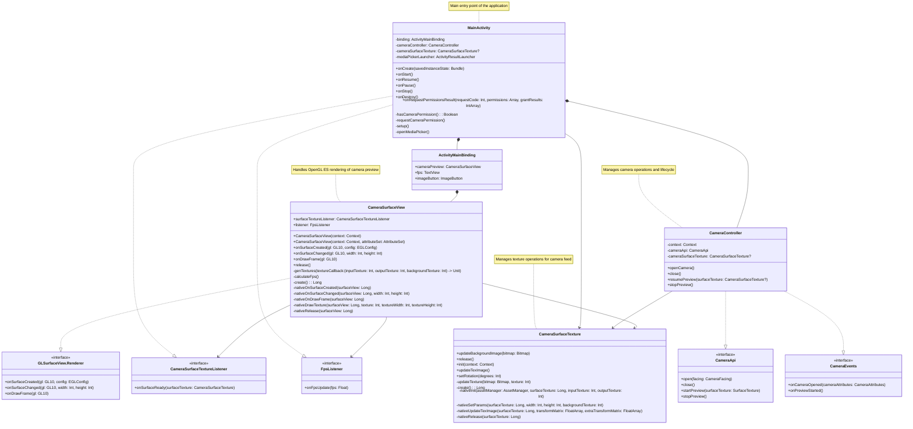

# Sample application to apply custom virtual backgrounds

## Table of Contents

1. [Introduction](#introduction)
2. [Class Diagram](#class-diagram)
3. [Camera Capturing](#camera-capturing)
4. [Camera Preview Rendering](#camera-capturing)
5. [Applying Virtual Background](#applying-virtual-background)
6. [Setup and Execution](#setup-and-execution)
7. [Demo](#demo)

## Introduction

This project leverages `TensorFlow Lite`'s body segmentation to replace the background in real-time on `Android` devices. Using deep learning models, it accurately detects and segments the human figure, allowing users to apply custom virtual backgrounds. Optimized for performance, it ensures smooth processing on mobile devices.

## Class Diagram

## Camera Capturing

The `Camera2` class implements the `CameraApi` interface and manages the camera lifecycle using Android's `Camera2` API. It initializes the camera via the `CameraManager`, handles operations on a background thread using `CameraHandler`, and notifies events through a `CameraEvents` listener. The `open(facing: CameraFacing)` method retrieves the camera ID, opens the camera, and initializes its attributes. The `startPreview(surfaceTexture: SurfaceTexture)` method sets up a `CameraCaptureSession` with a Surface created from the provided `SurfaceTexture`, configures a `CaptureRequest` for continuous frame capture, and starts the preview. The `stopPreview()` method stops the session, aborts captures, and releases resources. The `close()` method cleans up all camera resources, including the `CameraDevice` and `CaptureSession`. The `Attributes` inner class extracts camera characteristics like sensor orientation and supported preview sizes. This design ensures efficient camera management, thread safety, and event-driven notifications.

## Camera Preview Rendering

Video data is fed into `GL_TEXTURE_EXTERNAL_OES` using a producer-consumer pattern where a `SurfaceTexture` acts as the producer, receiving frames directly from the camera or a video decoder and storing them in `GPU` memory. The consumer is an `OpenGL ES` shader, which reads these frames from the external texture for rendering. The application must call `updateTexImage()` on the `SurfaceTexture` to synchronize the texture with the latest frame before rendering, ensuring efficient `GPU`-side processing without unnecessary memory copies.

The `CameraSurfaceView` class handles `OpenGL ES` based rendering of camera preview frames using a three-texture system: input texture for camera feed, output texture for processed frames, and background texture for virtual backgrounds. The rendering process begins with `CameraSurfaceTexture` processing the input frames, applying transformations through native code, and optionally blending with a background texture. In the `C++` implementation, the `DrawTexture` method binds the processed output texture, calculates the viewport dimensions to maintain the aspect ratio, and renders the texture using a triangle strip. The viewport is dynamically adjusted based on the texture and surface dimensions to avoid distortion. The vertex shader transforms vertex positions and passes texture coordinates to the fragment shader, which samples the texture and outputs the final pixel color. The shaders are compiled and linked into a program, which is used during rendering. This implementation ensures efficient, real-time, and aspect-ratio-correct rendering of camera frames with virtual background support, leveraging both `Kotlin` and `C++` for high-performance rendering.

## Applying Virtual Background

The `CameraVirtualBackgroundProcessor` class is responsible for processing video frames to apply a virtual background using `TensorFlow Lite` and `OpenGL ES`. It implements a pipeline that combines semantic segmentation to separate the foreground (a person) from the background and `OpenGL ES` shaders to blend the input frame with a virtual background texture. The implementation uses the `selfie_segmenter.tflite` model for real-time segmentation, which is loaded and executed using `TensorFlow Lite`. The segmentation mask generated by the model is used to blend the input frame with a virtual background texture. This process involves resizing the input frame, running the segmentation model, generating a mask texture, and using `OpenGL ES` shaders to render the final output. This class leverages both the `CPU` and `GPU` for efficient real-time video processing, making it suitable for applications such as virtual backgrounds in video conferencing or live streaming.

Here’s how it works:

1. **Initialization**: The Initialize method sets up the `TensorFlow Lite` interpreter and `OpenGL ES` resources. It loads the segmentation model (`selfie_segmenter.tflite`) from the assets using the Android `AAssetManager`. The `TensorFlow Lite` interpreter is configured, and tensors are allocated for input and output. `OpenGL ES` resources, including textures for the input frame, mask, and background, are created. Shader programs for resizing and blending operations are compiled and linked, and attribute locations for vertex positions and texture coordinates are retrieved.

2. **Resizing the Frame**: The `Resize` method resizes the input frame to match the dimensions (`256x256`) expected by the segmentation model. The input frame is rendered into a framebuffer using `OpenGL ES`, and the resized frame is read back into a `CPU` buffer using `glReadPixels`. The `AddPadding` utility function ensures the resized frame fits the model's input dimensions by adding padding if necessary.

3. **Loading the Model**: The `TensorFlow Lite` model is loaded during initialization. The model is configured to accept a resized input frame and output a segmentation mask. The mask is a probability map where each pixel represents the likelihood of belonging to the foreground (person). The model's input dimensions are stored for resizing operations, and the output tensor is used to generate the segmentation mask.

4. **Generating the Segmentation Mask**: The Process method runs the `TensorFlow Lite` model on the resized input frame to generate the segmentation mask. The mask is processed to create a binary texture, where pixels with a probability above a threshold (e.g., 0.5) are marked as foreground. The `RemovePadding` utility function ensures the mask matches the original frame's aspect ratio, and the mask is uploaded to the `GPU` as a texture using `UpdateTexture`.

5. **Rendering the Frame**: The `Mix` method uses `OpenGL ES` shaders to blend the input frame, background texture, and mask texture. The vertex shader transforms vertex positions and passes texture coordinates to the fragment shader. The fragment shader samples the input frame, background texture, and mask texture, blending them based on the mask values. The blended frame is rendered into the output framebuffer, which is bound to the output texture.

6. **Displaying the Frame**: The final blended frame is stored in the output texture, which can be displayed on the screen using the `CameraSurfaceView` class. The `CameraSurfaceView` class renders the output texture onto the screen, completing the virtual background application process.

## Setup and Execution

The project depends on `TensorFlow`, which in turn requires FlatBuffers C++ header files. To build the project, navigate to `virtual-background-android/app/src/main/cpp/third_party` and run the `setup_tensorflow.sh` bash script. This script clones specific versions of the `TensorFlow` and `FlatBuffers` repositories, builds the required `TensorFlow Lite` shared libraries, and copies them to the appropriate directories if the `Bazel` build system is installed. Otherwise, it will use the prebuilt libraries included in the project. After running the script, open the project in `Android Studio`, connect an `Android` device, and launch the application.

So the project already includes prebuilt `libtensorflowlite.so` shared libraries for various `CPU` architectures (`arm64-v8a`, `armeabi-v7a`, `x86`, `x86_64`). These libraries were built using the same `setup_tensorflow.sh` script. If you need to rebuild the libraries, the script will first check if `Bazel` is installed. If `Bazel` is available, the build process will start, and the final libraries will be copied to the appropriate folders. If `Bazel` is not installed, the script will print a message and exit. [Bazelisk](https://github.com/bazelbuild/bazelisk) is the recommended way to install `Bazel`, as it ensures compatibility with the required `Bazel` version. Additionally, `Bazel` requires the `Android` NDK (Native Development Kit) to build `Android` shared libraries. The script uses NDK version `21.4.7075529`, as newer versions may not be supported by `Bazel`.

Please note that the `setup_tensorflow.sh` script has been tested on Intel-based Mac system. It may require modifications to work on other platforms, such as ARM-based Macs or Linux/Windows systems.

## Demo

## Like This Project? Fuel It with a Coffee! ☕

